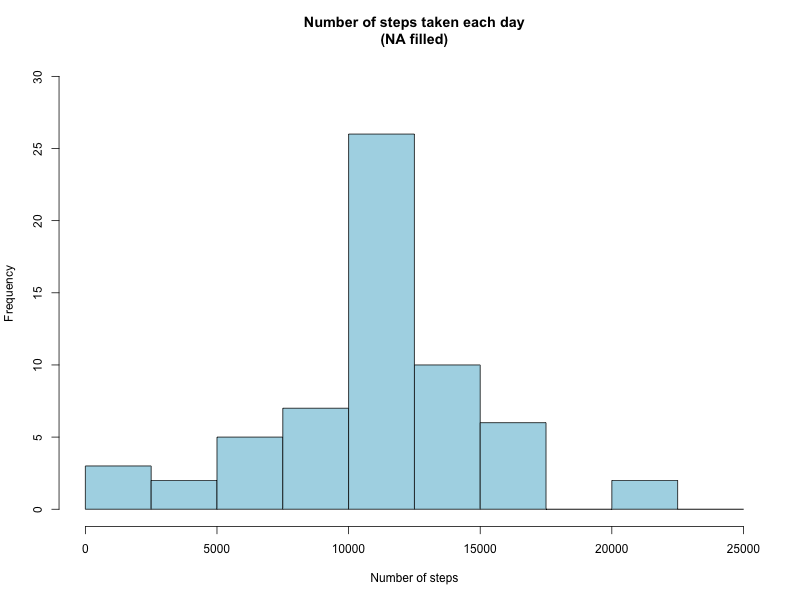
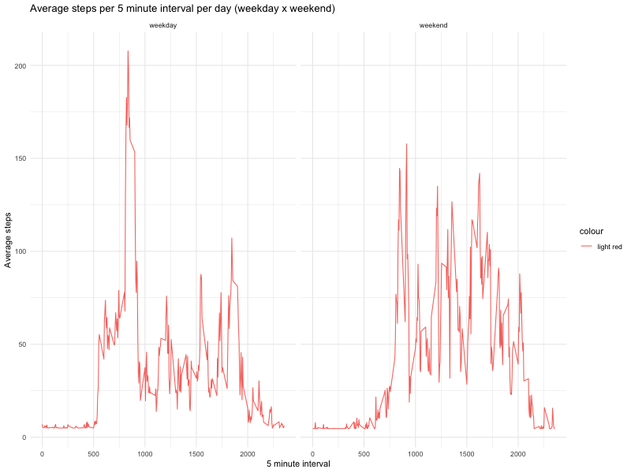

## Loading and preprocessing the data

Opening the csv file:
````{r Processing the data}
home <- getwd()
filename <- "activity.csv"
data <- read.csv(paste0(home, "/", filename), stringsAsFactors = FALSE)
data$date<-as.Date(data$date)
```

Inspecting the data:
```{r echo = TRUE}
library(dplyr)
glimpse(data)
```
## What is mean total number of steps taken per day?

Grouping the data by the date:
```{r}
grouped_steps <- data %>% group_by(date) %>% summarise(num_steps = sum(steps, na.rm = TRUE))
```

Plotting the histogram of the total number of steps taken per day:


```{r median and mean, echo=FALSE}
options(scipen=999)
#Median 
median_na_rm <- round(summary(grouped_steps$num_steps)[[3]],2)
#Mean
mean_na_rm <- round(summary(grouped_steps$num_steps)[[4]],2)
```

The median of the number of steps taken per day is: `r median_na_rm` and the mean is `r mean_na_rm`. 

## What is the average daily activity pattern?

Grouping the data by interval:
```{r}
grouped_avg_steps<-data %>% group_by(interval) %>% summarise(avg_steps = mean(steps,na.rm = TRUE))
```

Plotting the average steps taken per 5 minute interval per day:


```{r max, echo=FALSE}
max_steps <- grouped_avg_steps[[which.max(grouped_avg_steps$avg_steps), 1]]
```
Interval containing the maximum average steps: `r max_steps`

## Imputing missing values

The strategy used to fill NA values was to input the overall mean steps taken:
```{r}
#Copying the dataset
new_data <- data
#Inputing NA values with whe overall mean
new_data$steps[is.na(new_data$steps)] <- as.integer(mean(new_data$steps,na.rm=TRUE))
new_grouped_steps <- new_data %>% group_by(date) %>% summarise(num_steps = sum(steps, na.rm = TRUE))
```

Repeating the analysis with the NA's filled:

### Histogram

```{r, echo=FALSE}
options(scipen=999)
#Median 
new_median <- round(summary(new_grouped_steps$num_steps)[[3]], 2)
#Mean
new_mean <- round(summary(new_grouped_steps$num_steps)[[4]], 2)

```
Median: `r new_median`

Mean: `r new_mean`


## Are there differences in activity patterns between weekdays and weekends?

Getting the weekdays:
```{r}
new_data$days <-tolower(weekdays(data$date))
new_data$day_type <- ifelse(new_data$days == "saturday" | new_data$days == "sunday","weekend","weekday")
new_grouped_avg_steps <- new_data %>% group_by(interval, day_type) %>% summarise(avg_steps = mean(steps,na.rm = TRUE))
```

Timeseries plot:

