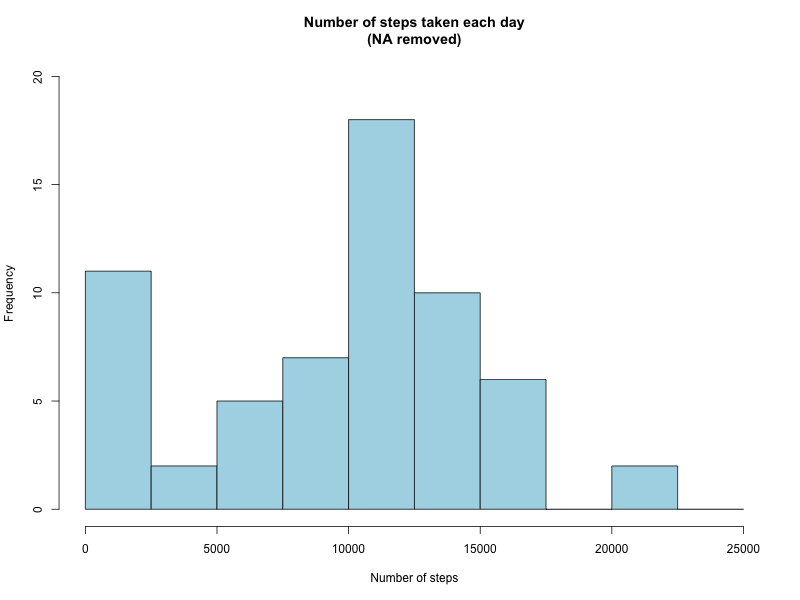
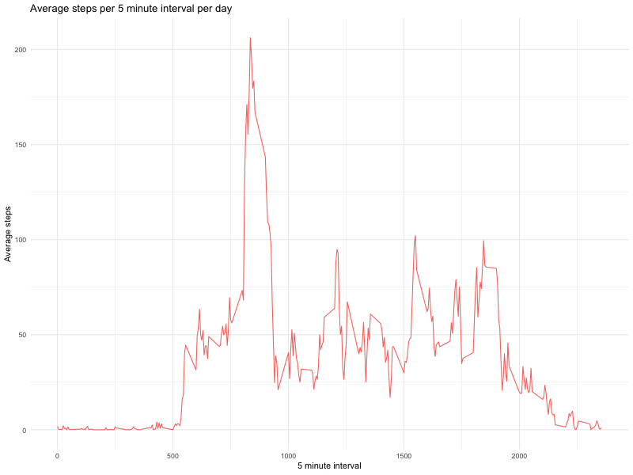
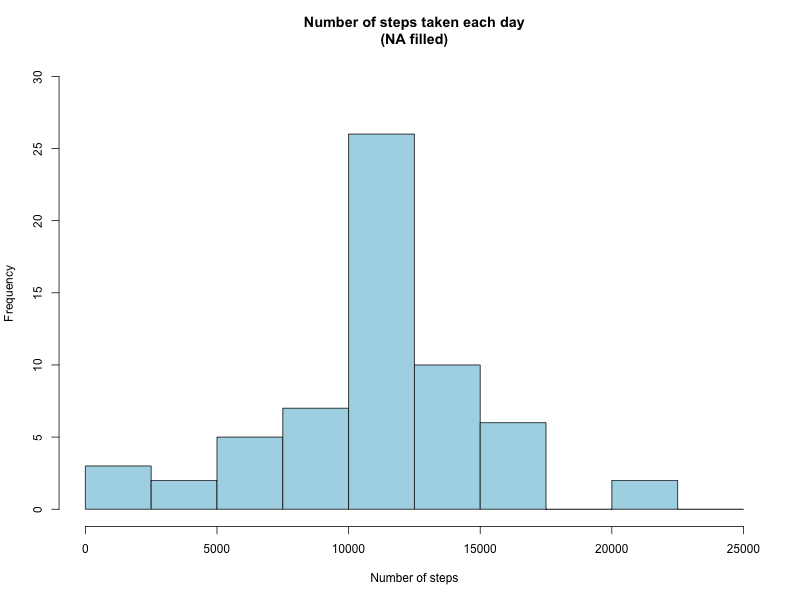
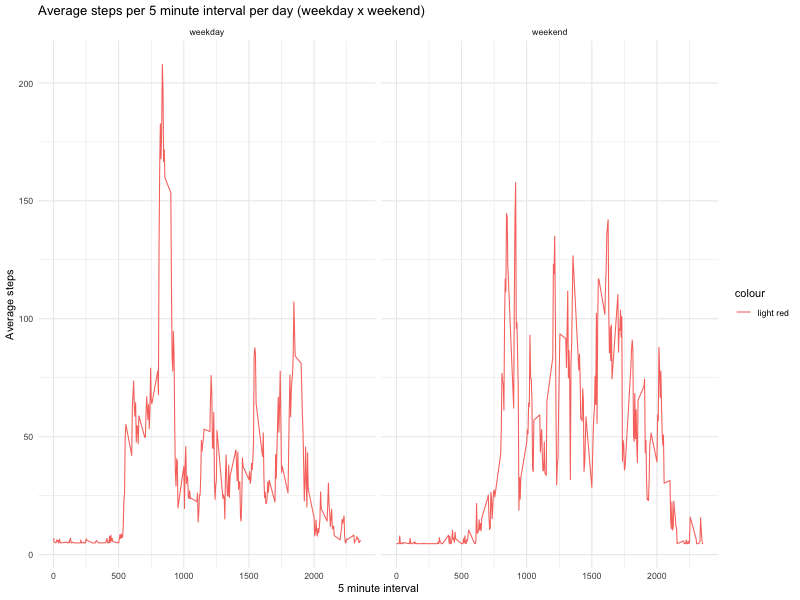

## Loading and preprocessing the data

Opening the csv file:

```r
home <- getwd()
filename <- "activity.csv"
data <- read.csv(paste0(home, "/", filename), stringsAsFactors = FALSE)
data$date<-as.Date(data$date)
```

Inspecting the data:

```r
library(dplyr)
```

```
## 
## Attaching package: 'dplyr'
```

```
## The following objects are masked from 'package:stats':
## 
##     filter, lag
```

```
## The following objects are masked from 'package:base':
## 
##     intersect, setdiff, setequal, union
```

```r
glimpse(data)
```

```
## Observations: 17,568
## Variables: 3
## $ steps    <int> NA, NA, NA, NA, NA, NA, NA, NA, NA, NA, NA, NA, NA, N...
## $ date     <date> 2012-10-01, 2012-10-01, 2012-10-01, 2012-10-01, 2012...
## $ interval <int> 0, 5, 10, 15, 20, 25, 30, 35, 40, 45, 50, 55, 100, 10...
```
## What is mean total number of steps taken per day?

Grouping the data by the date:

```r
grouped_steps <- data %>% group_by(date) %>% summarise(num_steps = sum(steps, na.rm = TRUE))
```

Plotting the histogram of the total number of steps taken per day:




The median of the number of steps taken per day is: 10395 and the mean is 9354.23. 

## What is the average daily activity pattern?

Grouping the data by interval:

```r
grouped_avg_steps<-data %>% group_by(interval) %>% summarise(avg_steps = mean(steps,na.rm = TRUE))
```

Plotting the average steps taken per 5 minute interval per day:



Interval containing the maximum average steps: 835

## Imputing missing values

The strategy used to fill NA values was to input the overall mean steps taken:

```r
#Copying the dataset
new_data <- data
#Inputing NA values with whe overall mean
new_data$steps[is.na(new_data$steps)] <- as.integer(mean(new_data$steps,na.rm=TRUE))
new_grouped_steps <- new_data %>% group_by(date) %>% summarise(num_steps = sum(steps, na.rm = TRUE))
```

Repeating the analysis with the NA's filled:

### Histogram


Median: 10656

Mean: 10751.74


## Are there differences in activity patterns between weekdays and weekends?

Getting the weekdays:

```r
new_data$days <-tolower(weekdays(data$date))
new_data$day_type <- ifelse(new_data$days == "saturday" | new_data$days == "sunday","weekend","weekday")
new_grouped_avg_steps <- new_data %>% group_by(interval, day_type) %>% summarise(avg_steps = mean(steps,na.rm = TRUE))
```

Timeseries plot:


